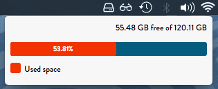

# HDD-widget
Little widget for Linux and OS X (Thanks Apple /s) that lives on your menubar that show you how much disk space you have left.



#### Build Instructions
Execute the following command to install all the necessary node dependencies:
```
npm install
```

###### OS X
To build the app for OS X, please execute the following command:
```
npm run build:osx
```

Now please navigate the "HDD-widget-darwin-x64" directory and copy the "HDD-widget.app" file into your Applications directory.

###### Linux
To build the app for Linux, please execute the following command:
```
npm run build:linux
```

Now please navigate the "HDD-widget-linux-x64" directory and run the "HDD-widget" UNIX executable.


Enjoy!
